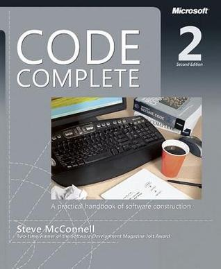
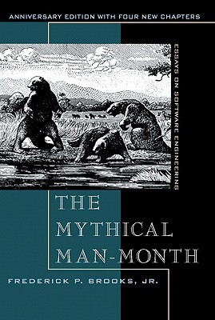
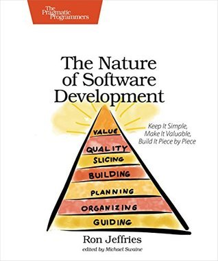

As I am nearing the end of my tenure at the company I co-founded a decade ago, I
thought it would be useful to share some of the books that were influential to
me as I went from engineer to a lead-of-leads.

## [Code Complete](https://www.goodreads.com/book/show/4845.Code_Complete) by Steve McConnell

This book probably feels a bit dated as it was published in 2004. However, I
found this very useful early in my engineering career as I was learning to build
systems that were maintainable and useful. Some of the maxims that McConnell
included in this book are true no matter the language. For example, "write
programs for people first, computers second." I often had a tendency to get
clever with code rather than trying to be blindingly obvious; being clever
tended to produce more pain (both for myself and others) down the road.

## [The Mythical Man Month: Essays on Software Engineering](https://www.goodreads.com/book/show/13629.The_Mythical_Man_Month) by Fred Brooks

This book makes "Code Complete" feel quite young as "Mythical" was written in 1975. However, it's commentary on software development is still timeless (if one can overlook some of the underlying sexism prevalent at the time). Two essays stuck with me more than others.

["There's No Silver Bullet"](https://en.wikipedia.org/wiki/No_Silver_Bullet) highlighted accidental complexity versus essential complexity. Much work has been done to address accidental complexity (especially since 1975!) but essential complexity, the complexity of the underlying problems that we're trying to solve, will always be with us. This one stuck with me because non-engineering types are _constantly_ enamoured by "silver bullets" - whether it's data science, machine learning, artificial intelligence, or whatever is coming next. Whenever they come upon a hard problem they ask, "Why don't we just use [the silver bullet]?" Even engineers like myself can fall prey to this way of thinking. The trouble is that these bullets rarely address _the complexity of the underlying problem space_.

In ["The Mythical Man Month"](https://en.wikipedia.org/wiki/The_Mythical_Man-Month#The_mythical_man-month) Brooks asserts that "adding manpower to a late software project makes it later." He highlights the importance of team communication in complex projects and provides a formula to demonstrate that more people means more and more communication overhead. I've heard this described by someone else as "clinks versus drinks." If you sit at a bar with three people, you clink three times and then you can drink. But as you add more and more people to the party, all of your time is spent clinking with very little time for drinking!

## [The Nature of Software Development](https://www.goodreads.com/book/show/25254918-the-nature-of-software-development) by Ron Jeffries

Ron Jeffries is one of the original signatories of the [agile
manifesto](https://agilemanifesto.org/). The manifesto has been pillaged and
plundered by consultants until it has become [something completely
unrecognizable](https://scaledagileframework.com/) from the original intent.
This book brings it all back home. We're just here to deliver value to our
customers!

The Stratasan and product and engineering teams read this as a group at least
twice. I found it to be extremely useful to help everyone get on the same page
about how a product-first company delivers value to customers. It helped us use
similar vocabulary ("tall and skinnies!" meaning high value, low cost). This
book was particularly useful because it explains the _process_ of software
development so well that you don't actually need to be a developer to understand
it. That makes it much more useful for development-adjacent roles like product
management, QA, etc.

## [Inspired](https://www.goodreads.com/book/show/35249663-inspired) by Marty Cagan and Chris Jones

Speaking of product management, this book and "[Empowered](https://www.goodreads.com/book/show/55954021-empowered)"
are aimed more at product managers. The Stratasan team read both of these books
as a group and I found them to be extremely helpful to communicate the vision
for a true product-first company.

If "The Nature of Software Development" was a good introduction to software
development for product managers, "Inspired" was a great introduction to product
management for software developers.

## [Accelerate](https://www.goodreads.com/book/show/35747076-accelerate) by Forsgren, Humble, and Kim

One of my biggest gripes with most "business" books is that they rarely have
data to back them up. Instead, they tend to rely on overly cute anecdotes to
emphasize or validate their assertions. "Accelerate" does not make this mistake.
You might be able to point out issues with their data collection (that's beyond
my pay grade) but they certainly have the data.

This book highlights the engineering metrics that correlate best with successful
organizations, based on annual surveys performed by the authors. They boil it
down to four key metrics. I'm not a fan of metrics for the sake of metrics, but
they make a very good case that these four metrics are really the ones you want
to watch.

## [The Manager's Path](https://www.goodreads.com/book/show/33369254-the-manager-s-path) by Camille Fournier

This book is broken out in a way that matches the trajectory of most careers in engineering management: from
individual contributor, to team lead, to manager of a single team, to multiple
teams, and then finally a manager of managers. This was a book I constantly kept
on hand as our company grew and I found myself referencing it often.

## [High Output Management](https://www.goodreads.com/is/book/show/324750.High_Output_Management) by Andrew Grove

I found the title of this book off-putting at first. Some of the anecdotes and
recommendations are a bit heavy on the manufacturing side (not necessarily
suitable advice for the creative endeavor of a product company). However, it's
good advice outweighed the anachronisms. It helped me understand a lot of the
reasoning behind OKRs. The single thing I took from this book: as a manager,
you're no longer responsible for _your_ work; you're now responsible for your
team's work. Your job is now to help your team grow. I found this helpful as I
was transitioning from an individual contributor, because I still was very
tempted to measure my success based on _my_ output, not my teams. Trying to
balance individual output and managing a team is a miserable existence: this
book got me out of that hole.

## [Traction](https://www.goodreads.com/book/show/18886376-traction) by Gino Wickman

This book might feel like the odd-one out in this anthology, but I include it
because it had a _huge_ influence on how we ran the day-to-day business at Stratasan.
Neither Jason Moore (CEO) nor myself had ever scaled a company to a hundred
people. This book and EOS helped us to set up a good cadence of meetings and
communication between the various teams. It allowed us to set the strategy,
execute on it, and bubble up issues more quickly.

We eventually moved away from stick adherence to EOS, but it served us well as
a solid foundation.

## What about you?

These are the books that I found to be most helpful during Stratasan's growth.
How about you? What books were instrumental in your professional growth? Leave a
comment or shoot me an email (brian at this domain).

> Photo by [Tom Hermans](https://unsplash.com/@tom_hermans) on [Unsplash](https://unsplash.com/photos/9BoqXzEeQqM)
