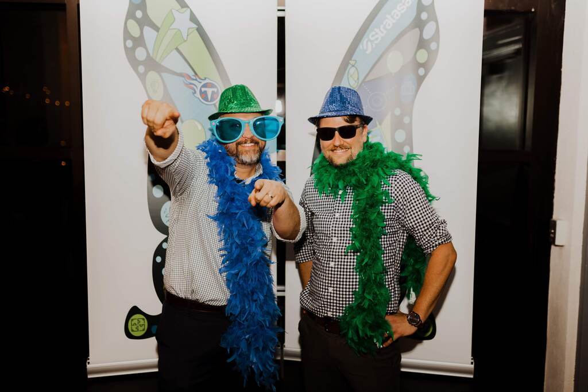

(I used to blog at [dailytechnology.net](https://dailytechnology.net) and will keep the
old Jekyll-based blog around just for historical purposes.)

In 2022, I ended a long tenure working for Stratasan, the company that I
co-founded with Jason Moore back in 2011. It has been a huge part of my career
and I doubt I will ever get to experience anything like it again.

I say that not because it was a successful company but because of the kinds of
people I got to work with. Ten years from now, I won't remember much about the
business strategy, the technical architecture, the effort we put into solid
ecurity patterns, or the roadmap priorities. What I'll remember is the people,
and how it felt to work with them.

Stratasan was special because our engineering and product
teams had a very high level of trust. If you have spent much time with Jason Moore, you
would learn that he is a special kind of leader. A lot of leaders like you to
think they know absolutely everything. Leaders must project confidence, yes, but
they also need to acknowledge that they can't know _everything_, and Jason Moore
walked that balance very well. Since leaders set the tone for the rest of the
company, this vulnerability cascaded down to new hires and became part of our culture.

I learned a lot at Stratasan. Every year or so my job description completely
changed. There are some things that I would have done differently. As an
engineer, I was used to fast feedback: if you do something silly, hopefully you
have some unit tests that fail and you go fix it. Management is completely
different. When you do something stupid, sometimes you don't know just how
stupid it was for weeks or even months. When I did make a mistake, I tried to
learn from it.[^1]

What's next for me? I'm not really sure. At this time, I have many personal
things that require my attention, so I am taking a pause to reassess my
priorities and decide what I want to spend my time on next. One thing I do know
that I'd like to do again is write, so that's why I've set this up.

See you next time!

[^1]: I enjoyed McArdle's "The Up Side of Down". [This EconTalk
  podcast](https://www.econtalk.org/mcardle-on-failure-success-and-the-up-side-of-down/)
  is a great summary.
